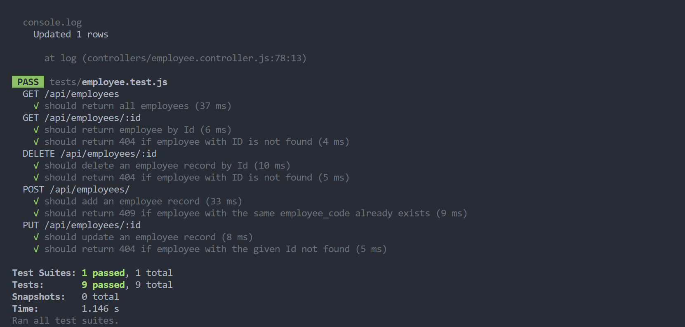
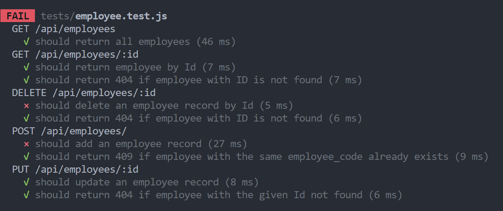

# Employee Management System

Welcome to the Employee Management System, a Node.js and Express application with MySQL as the database. This backend system allows you to efficiently manage employee data through various API endpoints. Whether you're retrieving employee information, adding new employees, updating salaries, or deleting employees, this Employee Management System provides the necessary functionality.

## Table of Contents

- [Tech Stack](#tech-stack)
- [Installation](#installation-for-local-environment)
- [API Reference](#api-reference)

### Tech Stack

- [Node.js](https://nodejs.org/)
- [Express.js](https://expressjs.com/)
- [MySQL](https://www.mysql.com/)
- [body-parser](https://www.npmjs.com/package/body-parser)
- [nodemon](https://www.npmjs.com/package/nodemon)

## Installation for Local Environment

1. Clone the repository:

   ```bash
   git clone https://github.com/Aftab0012/nodejs_mysql_crud.git
   ```

2. Change to the project directory:

   ```bash
   cd nodejs_mysql_crud
   ```

3. Install dependencies:

   ```bash
   npm install
   ```

4. Start the server:

   ```bash
   npm start
   ```

5. Add a .env file with the following content to run the server:

   ```bash
   HOST=localhost
   PORT=3306
   USER=root
   PASSWORD=your_mysql_password
   DATABASE=employee_db
   ```

6. Please make sure you have MySQL and a visual dashBoard like MySQL workbench installed so u can connect to DB seamlessly and see the data

Below are the Links to download the tools :-

MySQL community server

- <https://dev.mysql.com/downloads/file/?id=526084>

MySQL Workbench

- <https://dev.mysql.com/downloads/file/?id=525959>

## API Reference

### Employee API's

#### Retrieve all employees

- **Endpoint**: `GET http://localhost:3004/api/employees/`
- **Response**: Returns a JSON array of all employees.

  ```
  {
  "employees": [
      {
      "id": 9,
      "name": "Erina nakiri",
      "employee_code": "EMP008",
      "salary": 400000
      },
      {
      "id": 11,
      "name": "Alice Johnson",
      "employee_code": "EMP003",
      "salary": 80000
      }
  ]
  }

  ```

#### Retrieve an employee by ID

- **Endpoint**: `GET http:/localhost:3004/api/employees/:{add_employee_id}`

  ```
  {
  "employee": {
      "id": 9,
      "name": "Erina nakiri",
      "employee_code": "EMP008",
      "salary": 400000
  }
  }
  ```

- **Response**: Returns a JSON object of the employee with the specified ID.

#### Delete an employee by ID

- **Endpoint**:

  `DELETE http://localhost:3004/api/employees/:{add_employee_id}`

  ```
  {
  "message": "Deleted Successfully"
  }
  ```

- **Response**: Deletes the employee with the specified ID and returns 'deleted successfully' if successful.

#### Add a new employee

- **Endpoint**: `POST http://localhost:3004/api/employees/`
- **Request Body Format**:

  ```json
  {
    "name": "John Doe",
    "employee_code": "EMP001",
    "salary": 50000
  }
  ```

- **Response**: Returns a JSON object with the message 'Employee added successfully' if successful.

#### Update an employee by ID

- **Endpoint**:

  `PUT http://localhost:3004/api/employees/:id`

- **Request Body Format**:

  ```json
  {
    "name": "Updated Name",
    "employee_code": "EMP002",
    "salary": 60000
  }
  ```

- **Response**: Returns a JSON object with the message 'Updated successfully' if successful.

### Below is the database screenshot example:-


# Employee Management API Tests

The API is designed to manage employee data, providing endpoints for retrieving, adding, updating, and deleting employee records.

## Dependencies

Before running the tests, ensure you have the following dependencies installed:

- [Node.js](https://nodejs.org/) (version x.x.x)
- [npm](https://www.npmjs.com/) (version x.x.x)
- [Jest](https://jestjs.io/) (version x.x.x)
- [Supertest](https://www.npmjs.com/package/supertest) (version x.x.x)
- [mysql2](https://www.npmjs.com/package/mysql2) (version x.x.x)

Install the dependencies using the following command:

```bash
npm install
```

## Important Note: Database Connection

_**⚠️ The tests in this suite operate on a real-time MySQL database connection. Before running the tests, it's crucial to ensure that the database is properly set up, and any required values for testing (such as employee IDs) are known. ( Please look at the table and it will be more easy to adjust the employee Id's ), and please look into current written test cases and there ids to get idea how to adjust⚠️**_

## Running Tests

To execute the test suite, use the following command:

```bash
npm test
```

The tests cover various scenarios for the Employee Management API, including:

- Retrieving all employees.
- Retrieving an employee by ID.
- Deleting an employee by ID.
- Adding a new employee.
- Handling conflicts when adding an employee with an existing employee_code.
- Updating an existing employee.

## Sample Test Output

Running the test suite should produce output similar to the following:


Certainly! Here's how you can make the message noticeable using a README.md format:

# Important Notice

**Attention: If you have run the test cases before, follow these instructions carefully!**

If you've previously executed the test cases, it's crucial to update the test case IDs according to the `(NOTE)` provided at the bottom of the test file. Failure to do so will result in the following error:

### Instructions for Updating Test Cases

1. Open the test file in your preferred code editor.
2. Locate the `(NOTE)` section at the bottom of the `(employee.tests.js)` file.
3. Update each test case ID according to the provided guidelines.
4. Save the changes.

By ensuring that the test case IDs match the specified format, you'll avoid encountering errors during testing. Thank you for your attention to this matter!

## This how test cases looks if you dont update (id) after each (test run)



## Troubleshooting Tests

If you encounter issues running the tests, try the following steps:

1. Ensure all dependencies are installed (`npm install`).
2. Check your Node.js and npm versions.
3. Verify the correctness of your environment variables for connecting to the MySQL database.
